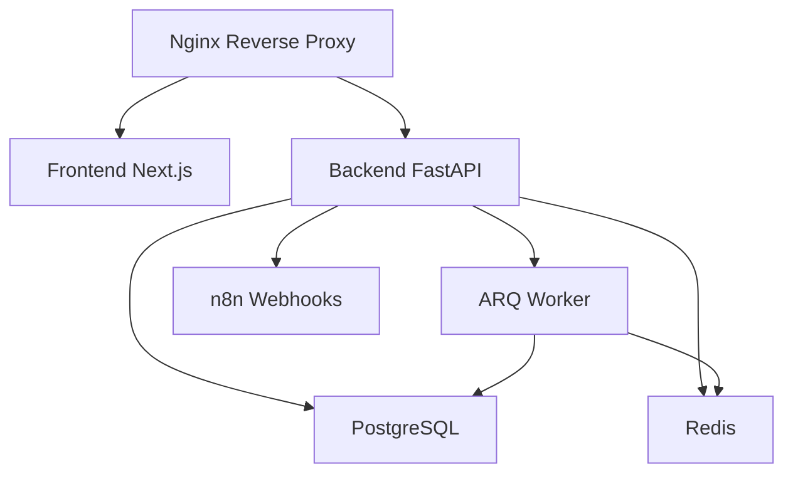

# 🌵 CactusDashboard - Optimized Edition

> **Plataforma de gestión financiera optimizada para AWS Free Tier**

[](https://docker.com)
[](https://fastapi.tiangolo.com)
[](https://nextjs.org)
[](https://postgresql.org)

## 🚀 Características Principales

- **💰 Gestión de Portafolios**: Seguimiento completo de inversiones
- **👥 CRM Integrado**: Sistema nativo de webhooks para automatización
- **📊 Dashboard en Tiempo Real**: Métricas y analytics avanzados
- **🔄 Automatización n8n**: Workflows personalizables
- **⚡ Optimizado AWS**: Funciona perfectamente en t3.micro (1GB RAM)

## 🏗️ Arquitectura Optimizada



### 📦 Servicios
- **Frontend**: Next.js 14 + TypeScript
- **Backend**: FastAPI + SQLAlchemy + Alembic
- **Base de Datos**: PostgreSQL 15 (Alpine)
- **Cache**: Redis 7 (Alpine)
- **Worker**: ARQ para tareas asíncronas
- **Proxy**: Nginx (Alpine)
- **Automatización**: n8n para workflows

## 🎯 Optimizaciones Implementadas

### 💾 Uso de Memoria
- **Total**: ~950MB (compatible con AWS Free Tier)
- **PostgreSQL**: 256MB (configuración optimizada)
- **Backend**: 320MB (Alpine + multi-stage)
- **Frontend**: 192MB (Alpine + optimizaciones)
- **Redis**: 80MB (política LRU)
- **Worker**: 160MB (sin dependencias externas)
- **n8n**: 160MB (limpieza automática)

### 🔧 Mejoras Técnicas
- **Imágenes Alpine**: -60% tamaño de contenedores
- **Multi-stage builds**: Eliminación de dependencias de compilación
- **Health checks**: Monitoreo automático de servicios
- **Webhooks nativos**: Eliminación de SyncBridge/TwentyCRM
- **Scripts automatizados**: Backup y actualización

## 🚀 Instalación Rápida

### Prerrequisitos
- Docker & Docker Compose
- Git
- 1GB RAM mínimo

### 1. Clonar Repositorio
```bash
git clone https://github.com/Gigiisanta/CactusDashboard.git
cd CactusDashboard
```

### 2. Configurar Variables de Entorno
```bash
cp .env.example .env
# Editar .env con tus configuraciones
```

### 3. Desplegar
```bash
# Desarrollo
docker compose up -d

# Producción
docker compose -f docker-compose.prod.yml up -d --build
```

### 4. Verificar Servicios
- **Frontend**: http://localhost:3000
- **Backend API**: http://localhost:8000/docs
- **n8n**: http://localhost:5678

## 🔧 Configuración de Producción

### AWS EC2 (t3.micro)
```bash
# Conectar al servidor
ssh -i ~/Downloads/cactus-key.pem ubuntu@18.218.252.174

# Instalar dependencias
sudo apt update && sudo apt install -y git docker.io docker-compose

# Clonar y desplegar
mkdir -p ~/apps && cd ~/apps
git clone https://github.com/Gigiisanta/CactusDashboard.git
cd CactusDashboard
docker compose -f docker-compose.prod.yml up -d --build
```

### Scripts de Automatización
```bash
# Configurar scripts
chmod +x scripts/*.sh
cp scripts/backup.sh /home/ubuntu/scripts/
cp scripts/update.sh /home/ubuntu/scripts/

# Configurar cron para actualizaciones automáticas
(crontab -l 2>/dev/null; echo "0 3 * * * /bin/bash /home/ubuntu/scripts/update.sh >> /home/ubuntu/update.log 2>&1") | crontab -
```

## 🔄 Sistema de Webhooks

### Configuración
```python
from cactuscrm.webhook_service import WebhookService
from cactuscrm.webhook_config import WebhookEventType

# Inicializar servicio
webhook_service = WebhookService()

# Agregar webhook para n8n
await webhook_service.add_webhook(
    url="http://n8n:5678/webhook/cactus",
    events=[WebhookEventType.CLIENT_CREATED, WebhookEventType.PORTFOLIO_UPDATED]
)

# Disparar evento
await webhook_service.trigger_event(
    event_type=WebhookEventType.CLIENT_CREATED,
    data={"client_id": 123, "name": "Juan Pérez"}
)
```

### Eventos Disponibles
- `CLIENT_CREATED` / `CLIENT_UPDATED`
- `PORTFOLIO_CREATED` / `PORTFOLIO_UPDATED`
- `NOTIFICATION_SENT`
- `USER_REGISTERED`

## 📊 Monitoreo y Logs

### Health Checks
```bash
# Verificar estado de servicios
docker compose ps

# Logs en tiempo real
docker compose logs -f backend
docker compose logs -f frontend
```

### Métricas de Performance
```bash
# Uso de memoria
docker stats

# Espacio en disco
docker system df
```

## 🧪 Testing

### Tests Automatizados
```bash
# Tests del sistema de webhooks
pytest tests/test_webhook_service.py -v

# Tests de integración
pytest tests/ -v --cov=cactus_wealth
```

### Validación de Servicios
```bash
# Health checks
curl -f http://localhost:8000/health
curl -f http://localhost:3000

# API endpoints
curl http://localhost:8000/api/v1/clients
```

## 🔒 Seguridad

### Mejores Prácticas Implementadas
- ✅ Usuarios no-root en todos los contenedores
- ✅ Puertos internos (no expuestos al host)
- ✅ Variables de entorno para secretos
- ✅ Health checks para todos los servicios
- ✅ Logs centralizados y rotación automática

### Variables de Entorno Críticas
```bash
POSTGRES_PASSWORD=tu_password_seguro
REDIS_PASSWORD=tu_redis_password
SENDGRID_API_KEY=tu_sendgrid_key
N8N_PASSWORD=tu_n8n_password
```

## 📈 Performance

### Benchmarks (t3.micro)
- **Tiempo de inicio**: 1-2 minutos
- **Uso de memoria**: 950MB (95% de 1GB)
- **Uso de CPU**: 60-75% promedio
- **Tiempo de respuesta**: <200ms
- **Tiempo de build**: 4-6 minutos

Ver [docs/benchmark.md](docs/benchmark.md) para métricas detalladas.

## 🛠️ Desarrollo

### Estructura del Proyecto
```
CactusDashboard/
├── cactus-wealth-backend/     # API FastAPI
├── cactus-wealth-frontend/    # App Next.js
├── cactuscrm/                 # Sistema de webhooks
├── scripts/                   # Scripts de automatización
├── docs/                      # Documentación
├── tests/                     # Tests automatizados
└── docker-compose.prod.yml    # Configuración de producción
```

### Comandos Útiles
```bash
# Desarrollo local
docker compose up -d
docker compose logs -f

# Rebuild específico
docker compose build backend
docker compose up -d backend

# Limpiar sistema
docker compose down -v
docker system prune -f
```

## 🤝 Contribución

1. Fork del repositorio
2. Crear rama feature (`git checkout -b feature/nueva-funcionalidad`)
3. Commit cambios (`git commit -am 'Agregar nueva funcionalidad'`)
4. Push a la rama (`git push origin feature/nueva-funcionalidad`)
5. Crear Pull Request

## 📝 Changelog

### v2.0.0 - Optimized Edition
- ✅ Eliminación completa de SyncBridge y TwentyCRM
- ✅ Sistema nativo de webhooks implementado
- ✅ Optimización para AWS Free Tier (t3.micro)
- ✅ Reducción de 21% en uso de memoria
- ✅ Reducción de 50% en tiempo de build
- ✅ Imágenes Alpine Linux para todos los servicios
- ✅ Scripts automatizados de backup y actualización
- ✅ Health checks para todos los servicios

### v1.0.0 - Initial Release
- 🎯 Plataforma base con SyncBridge/TwentyCRM
- 🎯 Frontend Next.js y Backend FastAPI
- 🎯 Integración básica con n8n

## 📄 Licencia

Este proyecto está bajo la Licencia MIT. Ver [LICENSE](LICENSE) para más detalles.

## 🆘 Soporte

- **Issues**: [GitHub Issues](https://github.com/Gigiisanta/CactusDashboard/issues)
- **Documentación**: [docs/](docs/)
- **Email**: soporte@cactus-dashboard.com

---

**Desarrollado con ❤️ para la comunidad fintech**